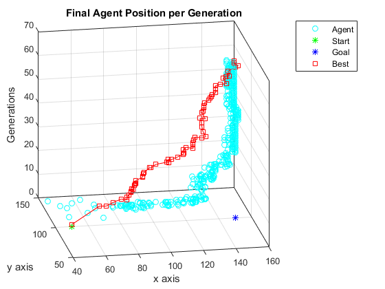

# Genetic Dots
Simulate dots walking across a plane over multiple generations, learning to become more accurate after every generation.

# Running
Open `Driver.m` in MATLAB 2015+ and click the `Run` button

# Config
* `Driver.m`
  * `start`: `(x, y)` coordinate where all dots start from
  * `goal`: `(x, y)` coordinate where all dots should try to get to
  * `num_gens`: number of generations to simulate
* `Move.m`
  * `pop_size`: population size
  * `num_keep`: the best this many individuals to keep each generation
  * `max_step`: the largest distance any individual can take in one simulation step
  * `mutation_rate`: the percentage of directions which will change on new individuals each generation
  * `plane_size`: the greatest coordinate (both x and y) that an agent can step to without dying off

# Misc Details
* The number of steps each generation is determined by the distance to `goal` from `start` in `Driver.m` and the `dist_modifier` in `Move.m`
* The `plane_size` in `Move.m` does not check if `start` and `goal` are within the bounds; ensure `start` and `goal` are within the square defined by the corners `(0, 0)` and the `plane_size` coordinate
* Diagonal `start` and `goal` coordinates yield better results than keeping `start` and `goal` on the same `x` or `y` line due to how new directions are chosen
